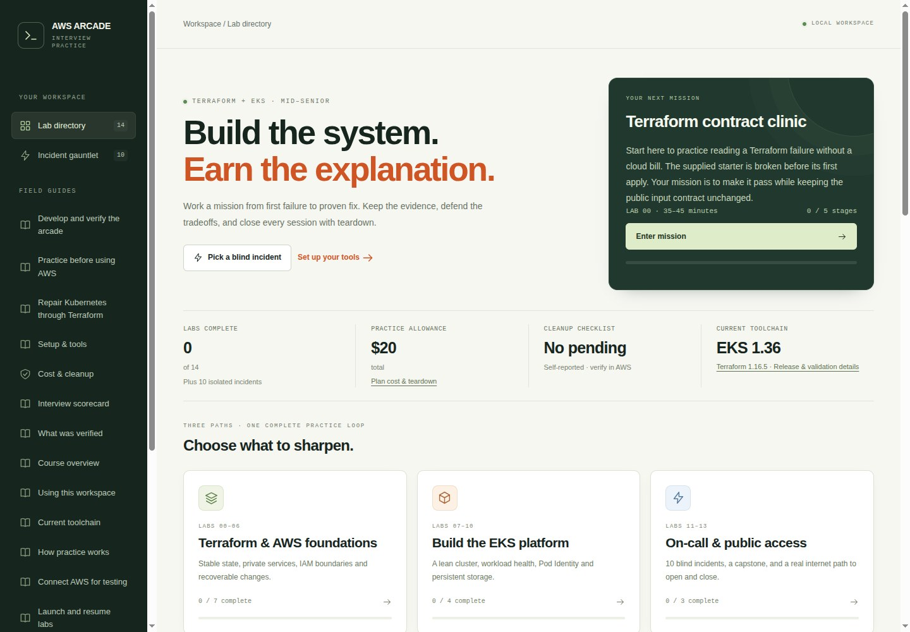
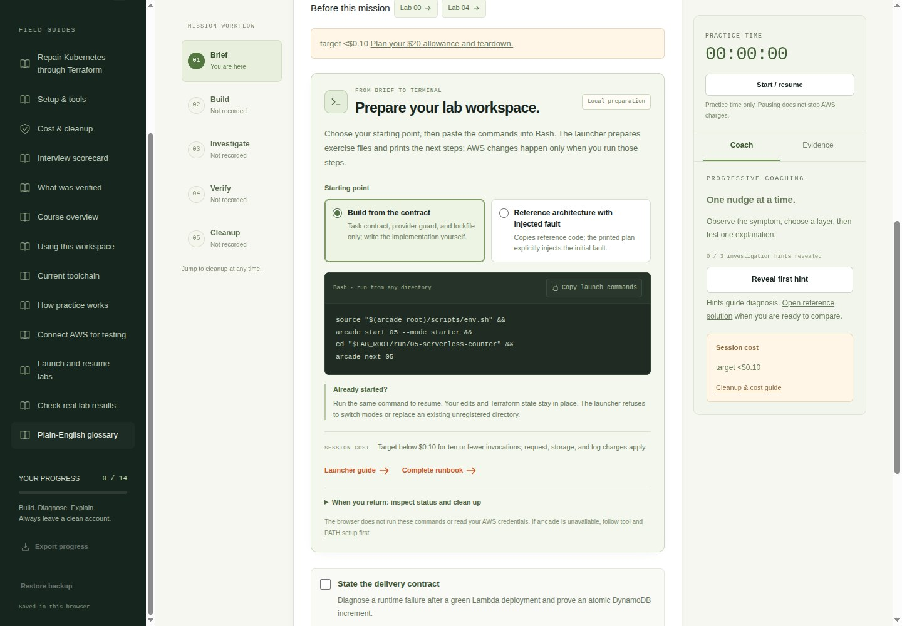
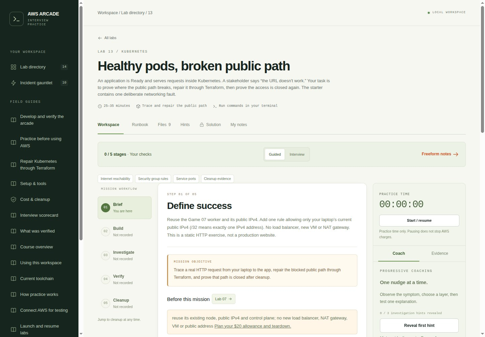

# AWS Interview Arcade · Terraform + EKS

Build small AWS systems. Diagnose deliberately broken ones. Explain your fix, prove it works, and tear everything down.

**24 missions for mid–senior DevOps, platform and SRE interviews:** 14 labs and 10 pod incidents, with a local web workspace, progressive hints, runnable examples and exact terminal commands. The questions use plain English and ask you to explain decisions you would make on the job.



## Start locally

The web app needs **Python 3.10+** and no Python packages, Node installation or AWS credentials. The tool installer and `arcade start` support **Linux and WSL2**. For other platforms, use the web app and follow the [manual setup guide](docs/setup.md).

```bash
mkdir -p "$HOME/work"
git clone https://github.com/patrick-hudson/eks-terraform-arcade.git \
  "$HOME/work/eks-terraform-examples"
cd "$HOME/work/eks-terraform-examples"
python3 web/server.py
```

Open **http://127.0.0.1:8765**. Keep this terminal running; use another for lab commands. If you already have this checkout, skip the clone.

To install the lab tools, open that second terminal. The installer needs Bash, Python 3.10+, curl, unzip, tar, GPG and sha256sum already installed:

```bash
cd "$HOME/work/eks-terraform-examples"
bash scripts/bootstrap-tools.sh
source scripts/env.sh
arcade doctor
```

Official downloads are verified and installed under the project's `.tools/` directory. The installer does not need sudo, edit shell startup files or sign you into AWS. Source the environment in each lab terminal to put `arcade`, `aws`, `terraform` and `kubectl` on PATH:

```bash
source "$HOME/work/eks-terraform-examples/scripts/env.sh"
arcade serve
```

`arcade serve` is an alternative to the Python command above; run one server. The default workload region is **us-west-2**. An existing region setting is preserved, so follow [setup](docs/setup.md) to select the account, profile and region explicitly before any cloud work.

## Work through a mission

The workspace follows **Brief → Build → Investigate → Verify → Cleanup**. Start with the symptom, write a hypothesis, and collect evidence before revealing another hint. Guided mode shows command checkpoints; Interview mode keeps them collapsed until you need them. A [plain-English glossary](docs/glossary.md) explains terms in context.

Use the launcher to prepare a practice copy without creating cloud resources:

```bash
arcade labs
arcade start 00
arcade next 00
arcade check 00
arcade status
```

Game 00 starts broken, so its first local check should fail. Edit the files under `run/00-contracts/` and rerun `arcade check 00`. It runs eight trusted Terraform checks against a temporary copy. `arcade check 05` similarly tests your counter's Python handler locally; it cannot prove AWS permissions or the managed Lambda runtime work.



`arcade start 05 --mode guided` prepares complete reference code for a walkthrough. `arcade start 11-01` prepares the first incident after you have built Game 07. The launcher prints each working directory, prerequisite and command; **it never runs Terraform apply**. Repeating `start` resumes a registered workspace without overwriting your edits or state. Games 11 and 12 are runbooks: the gauntlet points to individual incidents, and the capstone reuses Game 08's state.

Save the symptom, decisive command output, repair and deletion proof in the evidence notebook. Export an interview debrief or back up progress before clearing browser data. Progress is stored in your browser, and the app does not execute shell commands or connect to AWS. See the [workspace guide](docs/web-ui.md) and [launcher guide](docs/lab-launcher.md).

## Choose your game

| Game | Mission | Time box | Practice mode |
|---|---|---:|---|
| [00](labs/00-terraform-contracts/README.md) | Terraform types, stable resource names and input checks | 30–45m | Local broken start; $0 AWS |
| [01](labs/01-private-s3/README.md) | Private versioned S3 and complete cleanup | 35m | Build |
| [02](labs/02-remote-state/README.md) | Shared state, locking and recovery | 45m | Build + competing runs |
| [03](labs/03-vpc-routing/README.md) | Public/private subnet routes without a NAT gateway | 45m | Build + explain traffic paths |
| [04](labs/04-iam-boundaries/README.md) | Find why an IAM permission still denies access | 45m | Broken start |
| [05](labs/05-serverless-counter/README.md) | Lambda, DynamoDB, narrow permissions and logs | 45–60m | Broken start |
| [06](labs/06-state-rescue/README.md) | Import, unexpected changes and safe refactoring | 45m | Three recovery drills |
| [07](labs/07-eks-foundation/README.md) | Build one short-lived EKS cluster with Terraform | 45–60m | Shared cluster |
| [08](labs/08-kubernetes-release/README.md) | App rollout, health checks, traffic and access | 40m | Broken start |
| [09](labs/09-pod-identity/README.md) | Let a pod access exactly the S3 data it needs | 40m | Broken start |
| [10](labs/10-ebs-storage/README.md) | Attach storage, preserve data and remove its AWS disk | 40m | Broken start |
| [11](labs/11-incident-gauntlet/README.md) | Ten isolated incidents on the same cluster | 10–25m each | Debugging gauntlet |
| [12](labs/12-capstone/README.md) | Timed delivery, incident, change and cleanup interview | 90m | Integrate and explain |
| [13](labs/13-public-access/README.md) | Healthy pods, broken internet access | 25–35m | Trace and repair the public path |

The gauntlet covers image pull failures, missing configuration, crashes, scheduling, health checks, traffic selection, permissions, safe maintenance, Service ports and a stalled update. Incident titles do not give away the answer. Each has three progressive hints and a reference repair.

Times are practice time boxes; provisioning and deletion take additional billable time. Stretch questions ask you to explain production choices unless they explicitly say to deploy something.

## Every repair goes through Terraform

AWS repairs change the lab's `.tf` configuration or inputs. Kubernetes repairs change `candidate.yaml`, which the shared Terraform module reads and manages. Use `kubectl` to inspect pods, read logs and test traffic. The durable fix is a reviewed Terraform plan and apply, including for image and configuration problems. The [workload guide](docs/terraform-workloads.md) explains that flow.

After following the mission's setup and moving into its **own run directory**:

```bash
terraform init
terraform validate
terraform plan -out=repair.tfplan
terraform show repair.tfplan
terraform apply repair.tfplan
```

Use the mission's exact flags and inputs, then run its behavioral checks. A clean plan and a healthy pod do not prove users can reach the app.

Game 13 follows traffic from the application to its Service, node and AWS firewall rule. Its public test is a real `curl` from your laptop to the node's public address. Access is restricted to your current IPv4 address (`/32`); the lab reuses the existing worker and creates no load balancer or NAT gateway. After repairing the port in Terraform, prove the exact response arrives, then prove that public access closes after teardown.



## Keep the whole course within $20

The planning allowance is **$20 total**, with an estimated spend below $5 for the suggested short sessions in **us-west-2**. This is an estimate, not an enforced spending limit. Prices, retries and forgotten resources affect the bill. The [cost guide](docs/cost-and-cleanup.md) includes rates, a session ledger, shared-account guidance and deletion checks.

1. Work through Games 00–06 first, tearing down each cloud fixture when finished.
2. Build Game 07 once per EKS session and reuse it for the app, identity, storage and incident labs. Aim for about eight total cluster-hours across short sessions.
3. Keep the default one worker. No NAT gateway or load balancer is required. Leave time for deletion before ending the session.

A shared AWS account is supported: Terraform works from the resources recorded in each lab's state, rather than adopting everything in the account. Use distinct lab names, confirm the intended account and inspect every plan. Never import, modify or delete unfamiliar resources to make an exercise pass.

Follow each mission's cleanup order, then review a saved destroy plan from that same state directory:

```bash
terraform plan -destroy -out=destroy.tfplan
terraform show destroy.tfplan
terraform apply destroy.tfplan
terraform state list
```

For EKS, remove public access and workloads while the cluster is reachable. Verify storage disks are gone before deleting their driver, then remove identities/add-ons and the foundation. The full [cleanup sequence](docs/cost-and-cleanup.md) covers nested states and the remote backend exercise. Keep state and inputs until AWS deletion checks succeed. **Closing the web app, stopping its timer or deleting local files does not stop AWS charges.**

## What has actually been tested

Local checks cover the web app, progress storage, launch preparation, cleanup/preflight logic, the Lambda handler, Terraform contracts and mocked Kubernetes plans. The app can import read-only verification receipts for **Games 07/08 and incidents 01–08**. Other missions use their documented manual acceptance checks; importing a file does not certify the environment.

A real AWS login and an isolated Game 05 plan were checked: **five creates, zero changes, zero destroys**. No cloud apply was performed as part of kit validation. Live EKS scheduling, Kubernetes admission, managed Lambda execution and the public HTTP path still need testing in your chosen account. See [validation evidence](docs/VALIDATION.md) and the [scoped AWS smoke-test guide](docs/aws-testing.md).

The release check on **October 4, 2026** selected **Terraform 1.16.5, EKS 1.36, kubectl 1.36.5 and AWS CLI 2.37.9**, with locked provider versions. [Toolchain sources and limits](docs/toolchain.md) distinguish installed versions from releases verified through official documentation. Recheck support before running the paid labs later.

## Explore or contribute

```text
labs/                      missions, starter code, hints and reference repairs
modules/kubernetes-exercise/ Terraform ownership for Kubernetes exercise files
run/                       your practice copies, state and evidence; ignored by Git
web/                       local Python server and browser app
scripts/                   launcher, local checks and AWS verification tools
docs/                      setup, glossary, cost, interview and development guides
```

[Development and CI commands](docs/development.md) · [Interview scorecard](docs/interview-scorecard.md) · [Learning design](docs/learning-design.md) · [Third-party notices](web/THIRD_PARTY_NOTICES.md)

Keep state, plans, credentials and personal `.tfvars` files out of Git. Keep provider lockfiles. Developed with Compound Engineering planning, parallel implementation and review; the validation record is the authority for what was executed.
