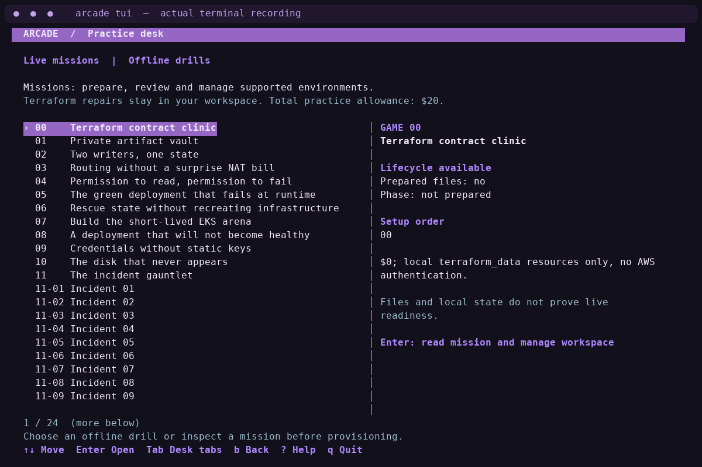
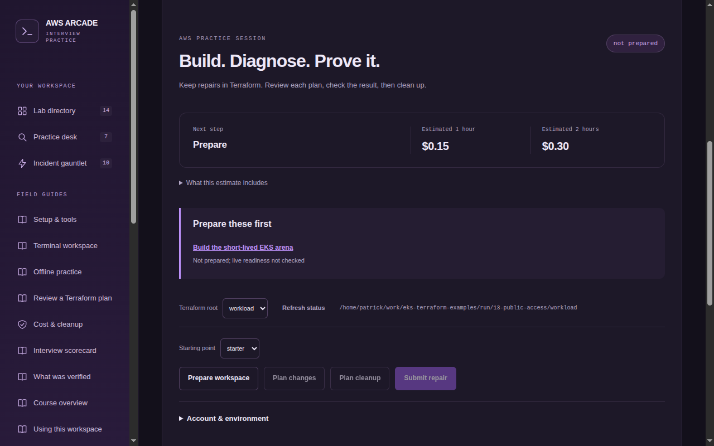
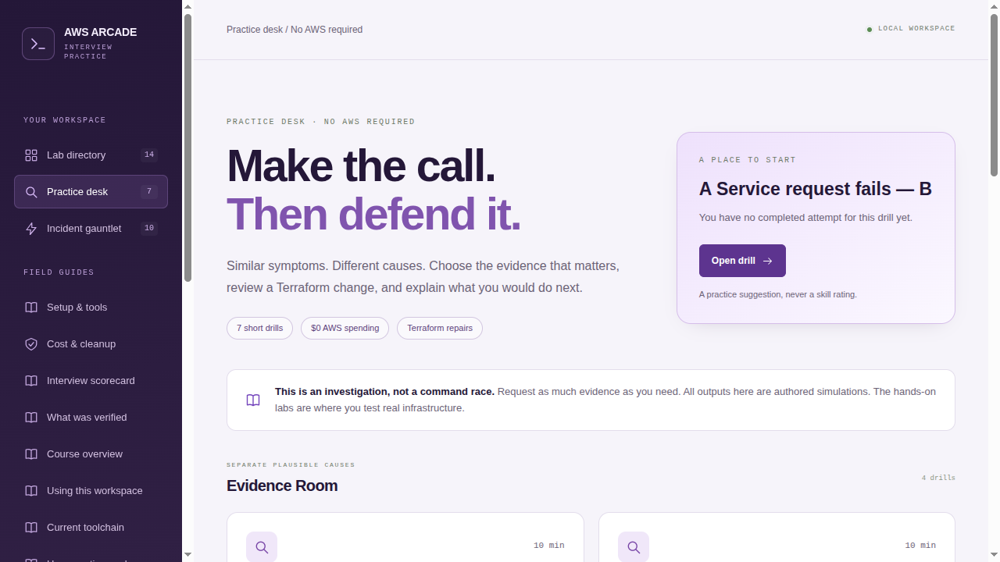

# AWS Interview Arcade · Terraform + EKS

Build real AWS environments, diagnose broken workloads, repair them through Terraform and prove they are gone when finished. These exercises target mid–senior DevOps, platform and SRE interviews.

**Start with Game 07 → Incident 11-01:** write the Terraform for one EKS cluster, deploy a deliberately broken app, investigate it with `kubectl`, then repair and destroy it through Terraform. You can go straight to AWS; the local exercises are optional.

## Start your first real AWS lab

**Follow [Launch an AWS lab](docs/lab-launcher.md) for the complete setup → deploy → repair → cleanup walkthrough.** It tells you which directory to use and which commands to run at each step.

Need the project first?

```bash
git clone https://github.com/patrick-hudson/eks-terraform-arcade.git eks-terraform-examples
cd eks-terraform-examples
```

Already using this checkout? Start here:

```bash
cd ~/work/eks-terraform-examples
./arcade setup
source scripts/env.sh
./arcade doctor
```

Use your checkout's actual path if it lives elsewhere. Setup installs verified tools under `.tools/`; it does not sign you into AWS. Linux and WSL2 need Bash, Python 3.10+, curl, unzip, tar, GPG and sha256sum installed first. See [tool installation](docs/setup.md#2-install-tools-and-activate-a-lab-terminal) for other platforms. Source `scripts/env.sh` in every lab terminal so `aws`, `terraform` and `kubectl` are on PATH.

Next, [authenticate your AWS profile and confirm the account](docs/setup.md#3-authenticate-and-pin-the-intended-account). Use **us-west-2**. EKS also needs your permanent IAM role/user ARN, your current public IPv4 `/32` and [the EKS preflight](docs/setup.md#4-check-eks-support-and-capacity-before-game-07). An STS session ARN cannot replace the permanent IAM ARN.

The one-worker EKS foundation is estimated at **$0.15 for one hour / $0.30 for two hours**, before extra usage. Provisioning and deletion time count. Reuse that cluster across incidents and reserve 20–30 minutes for cleanup. These are [estimates, not a spending cap](docs/cost-and-cleanup.md).

## Launch from the terminal

From the project directory:

```bash
./arcade tui
```

1. Open **07 · Build the short-lived EKS arena**. Choose **Prepare starter: Author the platform**. This copies `versions.tf`, the provider lockfile and `BUILD.md` into `run/07-eks-foundation/`; it does not build the cluster for you.
2. **Write `run/07-eks-foundation/main.tf` yourself**, following the requirements in `BUILD.md`. Use the [Game 07 hints](labs/07-eks-foundation/HINTS.md) when needed. Complete the required resources, input variables and outputs before planning.
3. Choose **Configure account, profile and required inputs**, then **Plan changes and review saved plan**. Check the account, region, one worker and restricted API access.
4. Choose **Review / apply saved plan (typed confirmation)** and enter the displayed approval phrase. This is the step that creates billable AWS resources. After it finishes, choose **Submit repair / check observed behavior** and complete the Game 07 readiness checks.
5. Return to the mission list and open **11-01 · Incident 01**. Choose **Prepare starter: Broken incident**, configure it with the same AWS identity, then plan and apply it. This creates the broken app on your cluster.
6. Follow the incident runbook to investigate and edit `run/scenario-01/candidate.yaml`. Plan and apply the repair, then submit its checks. When finished, destroy **11-01 first, then 07** and verify deletion.

**Optional shortcut:** **Prepare guided: Reference foundation** copies the completed cluster code for a session focused on pod incidents. Choose starter to do the Game 07 infrastructure-building exercise.

Opening a mission only selects it. **Prepare** only copies files. **Apply** runs the reviewed Terraform changes. If a workspace already exists, the TUI offers **Resume prepared workspace (preserve edits and state)**; it does not silently replace your files or switch preparation modes.

The [TUI walkthrough](docs/tui.md#first-session-game-07-then-incident-11-01) explains the exact actions, shell activation for `kubectl` and cleanup. Press **/** to search, **c** for cleanup, **r** for repair evidence and **i** for resource IDs. The TUI needs an interactive terminal and Python's standard-library `curses`.



## Prefer the browser?

From the project directory, start the local server with execution enabled:

```bash
./arcade serve --runner
```

Open **[Game 07 → Environment](http://127.0.0.1:8765/#/lab/07-eks-foundation?tab=session)**. Choose starter preparation, write the cluster Terraform in the prepared directory, then configure, review its plan, approve and check readiness. Then open Incident 11-01. Keep the server terminal running while using it; Ctrl-C stops the server and leaves AWS resources running.

The **Environment** tab includes prerequisite links, 1-hour and 2-hour estimates, repair evidence, retained resource IDs and separate cleanup controls. **Appearance** offers System, Light and Dark themes. Ordinary `./arcade serve` is read-only; use `--runner` for these environment actions. See [the browser guide](docs/web-ui.md).



CLI, TUI and browser controls share the same Terraform workspaces and saved plans. Games **01, 03, 04, 05, 07, 08, 09, 10, 13 and incidents 11-01 through 11-10** support this environment workflow, as does optional local Game 00. Games **02, 06 and 12** use their ordered runbooks for state migration, import and multi-lab work. The [launcher guide](docs/lab-launcher.md) has the command-line route and explains missions with more than one Terraform directory.

## Choose your game

| Game | Mission | Time box | Practice mode |
|---|---|---:|---|
| [00](labs/00-terraform-contracts/README.md) | Terraform types, stable resource names and input checks | 30–45m | Local broken start; $0 AWS |
| [01](labs/01-private-s3/README.md) | Private versioned S3 and complete cleanup | 35m | Build |
| [02](labs/02-remote-state/README.md) | Shared state, locking and recovery | 45m | Build + competing runs |
| [03](labs/03-vpc-routing/README.md) | Public/private subnet routes without a NAT gateway | 45m | Build + explain traffic paths |
| [04](labs/04-iam-boundaries/README.md) | Find why an IAM permission still denies access | 45m | Broken start |
| [05](labs/05-serverless-counter/README.md) | Lambda, DynamoDB, narrow permissions and logs | 45–60m | Broken start |
| [06](labs/06-state-rescue/README.md) | Import, unexpected changes and safe refactoring | 45m | Three recovery drills |
| [07](labs/07-eks-foundation/README.md) | Build one short-lived EKS cluster with Terraform | 45–60m | Shared cluster |
| [08](labs/08-kubernetes-release/README.md) | App rollout, health checks, traffic and access | 40m | Broken start |
| [09](labs/09-pod-identity/README.md) | Let a pod access exactly the S3 data it needs | 40m | Broken start |
| [10](labs/10-ebs-storage/README.md) | Attach storage, preserve data and remove its AWS disk | 40m | Broken start |
| [11](labs/11-incident-gauntlet/README.md) | Ten isolated incidents on the same cluster | 10–25m each | Debugging gauntlet |
| [12](labs/12-capstone/README.md) | Timed delivery, incident, change and cleanup interview | 90m | Integrate and explain |
| [13](labs/13-public-access/README.md) | Healthy pods, broken internet access | 25–35m | Trace and repair the public path |

The gauntlet covers image pull failures, missing configuration, crashes, scheduling, health checks, traffic selection, permissions, safe maintenance, Service ports and a stalled update. Incident titles do not give away the answer. Each has three progressive hints and a reference repair.

Times are practice time boxes; provisioning and deletion take additional billable time. Stretch questions ask you to explain production choices unless they explicitly say to deploy something.

## Repair, verify and clean up

The browser follows **Brief → Build → Investigate → Verify → Cleanup**, with progressive hints and an evidence notebook. Save the symptom, decisive observation, Terraform repair, recovery proof and deletion evidence. Back up progress before clearing browser data. The [glossary](docs/glossary.md) explains terms in plain English.

Every durable repair goes through Terraform. AWS repairs change `.tf` files or inputs. Kubernetes repairs change `candidate.yaml`, which the shared Terraform module manages; use `kubectl` for diagnosis. After following the mission's setup and moving into its **own run directory**, review the saved plan:

```bash
terraform init
terraform validate
terraform plan -out=repair.tfplan
terraform show repair.tfplan
terraform apply repair.tfplan
```

Use the mission's exact flags and inputs, then run its behavioral checks. A clean plan or healthy pod does not prove users can reach the app. Game 13 requires an actual internet `curl` to the node's public address, restricted to your current IPv4 `/32`, followed by proof that access closes after teardown. It reuses the worker without a load balancer or NAT gateway. See [Terraform-managed workloads](docs/terraform-workloads.md).

## Keep the whole course within $20

The planning allowance is **$20 total**, with an estimated spend below $5 for the suggested short sessions in **us-west-2**. This is an estimate, not an enforced cap. Prices, retries and forgotten resources affect the bill; use the [cost guide and session ledger](docs/cost-and-cleanup.md).

1. Start with Game 07 and an incident, or choose a standalone AWS mission such as Game 05. Earlier game numbers are not prerequisites for EKS.
2. Build Game 07 once per EKS session and reuse it for the workloads and incidents. Aim for about eight total cluster-hours across short sessions.
3. Keep the default one worker, with no NAT gateway or load balancer. Tear down standalone AWS fixtures after each session and reserve time for deletion.

In a shared account, use distinct lab names, confirm the intended account and inspect every plan. Only manage resources owned by the lab's state. Never import, modify or delete unfamiliar resources to make an exercise pass.

Follow the mission's cleanup order, then review a saved destroy plan from that same state directory:

```bash
terraform plan -destroy -out=destroy.tfplan
terraform show destroy.tfplan
terraform apply destroy.tfplan
terraform state list
```

For EKS, remove public access and workloads while the cluster is reachable; verify storage disks are gone before removing their driver, then remove identities/add-ons and the foundation. Follow the [complete cleanup sequence](docs/cost-and-cleanup.md) for nested states and the remote backend. Keep state and inputs until AWS deletion checks succeed. **Closing the app or terminal, stopping a timer or deleting local files does not stop AWS charges.**

## Optional practice without AWS

The catalog has **31 exercises:** 24 hands-on missions (14 labs and 10 pod incidents), plus seven simulated drills. Four simulations practice investigations; three practice reading Terraform plans. They use authored evidence, so finishing one does not verify a live environment or complete a hands-on mission.

For a browser drill, run `./arcade serve` from the project directory and open [the Practice desk](http://127.0.0.1:8765/#/practice). Choose an investigation, reveal an observation, make a decision, then choose **Finish attempt** to save the summary. This needs Python 3.10+, Bash and Git, with no AWS credentials, downloaded lab tools, pip packages or Node installation.



For the CLI version:

```bash
./arcade drill list
./arcade drill show ID
./arcade drill evidence ID EVIDENCE_ID
./arcade drill answer ID OPTION_ID
```

Use IDs printed by the preceding command. CLI drills are stateless; browser attempts are saved separately. `./arcade review-plan PATH` reads local Terraform show JSON and reports actions and uncertainty without displaying plan values or approving an apply. [The workspace guide](docs/web-ui.md) explains history and backups.

Game 00 is an optional local Terraform exercise. With the tools installed, run `./arcade start 00`, edit the prepared files under `run/00-contracts/`, then run `./arcade check 00`. Its first check should fail because the starting code is broken. `./arcade next 00` prints the next steps; `./arcade status` lists registered workspaces. Preparation preserves edits and state and never applies resources.

The root entry works before PATH activation. From another directory, use its absolute path, such as `"/path with spaces/eks-terraform-examples/arcade" help`.

## Evidence and further reading

Simulated feedback, local Terraform observations and live cloud evidence are different. Offline checks do not prove live IAM permissions, EKS behavior, managed Lambda execution, internet reachability or deletion. The [validation record](docs/VALIDATION.md) records local and live checks separately, including their failures, cleanup evidence and remaining gaps; the [AWS smoke-test guide](docs/aws-testing.md) describes scoped live checks. Tool versions and support limits are in the [toolchain record](docs/toolchain.md).

[Development and CI](docs/development.md) · [Interview scorecard](docs/interview-scorecard.md) · [Learning design](docs/learning-design.md) · [Third-party notices](web/THIRD_PARTY_NOTICES.md)

Keep state, plans, credentials and personal `.tfvars` out of Git and shared progress backups. Keep provider lockfiles. Your practice files and state belong under `run/`; authored missions are under `labs/`, and simulated drills under `practice/`.
