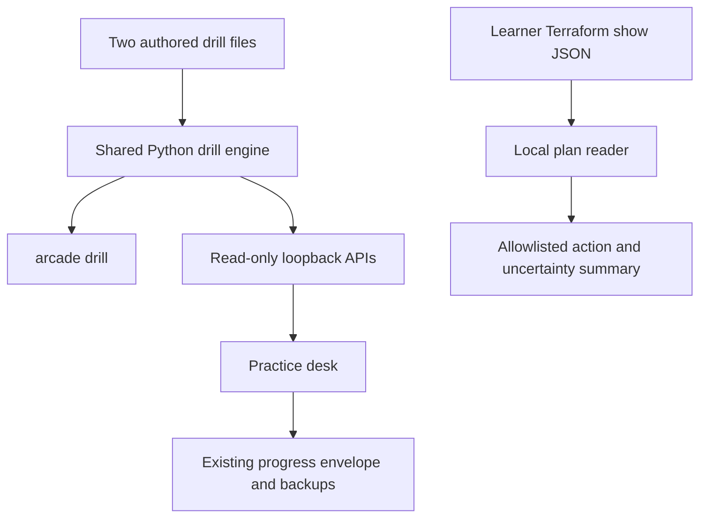
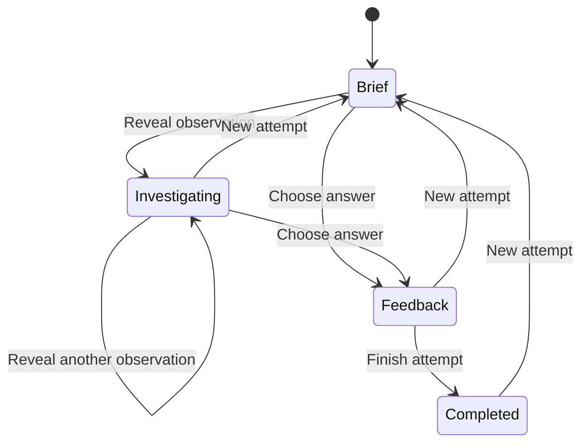

# Practice Before Provision - Plan

## Goal Capsule

- **Objective:** Learners can practice choosing diagnostic evidence and judging Terraform changes before spending money on AWS, then explain what their observations do and do not prove.
- **Means:** A shared authored drill catalog, a value-free local plan reader and a browser practice surface (KTD1, KTD2, KTD3).
- **Authority:** User instructions take precedence, then Product Contract requirements, then Planning Contract decisions. The existing 24 hands-on missions remain the live practice curriculum.
- **Execution profile:** Three parallel implementation units with exclusive ownership, followed by bounded terminal provisioning and setup/release integration. Root coordinates verification and publication.
- **Stop conditions:** Stop only for a material conflict with the Product Contract or an unavailable prerequisite that prevents meaningful progress; no live AWS provisioning is required.
- **Open blockers:** None. The user delegated reversible product choices and asked for autonomous implementation.

---

## Product Contract

### Summary

Add a Practice desk with four simulated investigations and three Terraform plan-reading drills. Add a local command that explains a learner's saved Terraform plan without printing its values, plus a terminal menu for choosing practice and managing explicitly supported lab environments. Keep short attempt summaries so the learner can choose what to repeat, and make the first local session easier to start.

### Problem Frame

The arcade already provides broken infrastructure, commands, hints and a debrief notebook. Its repeated exercises still use the same faults, and the two local check commands cover only Games 00 and 05. Learners need a cheaper way to rehearse the interview decisions between commands: which evidence separates plausible causes, which changes deserve scrutiny, and what remains unproven after a plan or successful apply.

### Options Considered

| Direction | Value for this repository | Limitation | Decision |
|---|---|---|---|
| More live incident variants | Harder to memorize existing faults | Multiplies cloud validation and namespace ownership work | Defer |
| A terminal menu | Prepares and manages supported environments alongside offline practice | Needs explicit paid-action boundaries and supported-root limits | Build bounded lifecycle support |
| Simulated investigations | Makes evidence selection repeatable with no AWS spending | Must remain clearly separate from live observations | Build |
| Local Terraform plan coach and reading drills | Adds practical review judgement to every existing mission | Cannot certify ownership, price or safety | Build |
| Attempt history and repeat suggestions | Gives completed practice a useful next action | Hint use is not a measure of competence | Build a bounded version for the new drills |
| Automated cost enforcement or timed teardown | Could reduce forgotten resources | Local files cannot reliably enforce a shared-account allowance | Exclude |
| Session shutdown agenda | Combines existing cleanup instructions | Separate useful outcome from this practice loop | Defer |

### Key Decisions

- **Durable repairs remain in Terraform.** Governs R10. (session-settled: user-directed — chosen over Console or imperative repairs: fixes must remain reproducible and reviewable.)
- **Mid-senior judgement uses plain English.** Governs R5. (session-settled: user-directed — chosen over beginner-only drills and unexplained jargon: the learner is preparing for engineering interviews.)
- **Cloud work remains explicit and scoped.** Governs R10. (session-settled: user-directed — chosen over automatic expensive sandboxes: the account contains unrelated resources and has a $20 total practice allowance.)
- **Use a purple visual identity.** Governs R8. The user requested purple; preserving readable status colors and contrast is an implementation constraint.
- **Practice before provisioning is this release's core.** Governs R1, R2, R3, R6. The new exercises train decisions already required by the live labs.

### Requirements

**Diagnosis and Terraform judgement**

- R1. Provide four authored, explicitly simulated investigations in two same-symptom pairs, each with a different cause and evidence that separates at least two plausible explanations.
- R2. Provide three authored Terraform plan-reading drills covering replacement and its order, an address change versus a move, and incomplete evidence such as unknown values or drift.
- R3. Let learners inspect one selected observation at a time, choose a diagnosis or review decision, and receive a plain-English explanation tied to decisive evidence.
- R4. Provide a local plan-reading command that accepts Terraform show JSON from a file or standard input and explains action counts, replacement order, moves, imports and material uncertainty without approving an apply.
- R5. Each drill ends with a Terraform-owned repair explanation where relevant, the evidence needed to prove recovery, cleanup considerations, a short changed-constraint interview prompt and links to relevant existing missions.

**Repeat practice and delivery**

- R6. Preserve up to 20 explicit completed-attempt summaries for the new drills through browser storage and progress backup/restore, and suggest a repeat with a visible reason based on those summaries.
- R7. Make new drill briefs, requested evidence and answer feedback available through both the CLI and browser without executing shell commands or connecting to AWS.
- R8. Give the browser a readable purple theme and a clear Practice desk entry while preserving existing mission progress, keyboard access and mobile layout.
- R9. Make the README's first successful local exercise work without AWS credentials or downloaded lab tools, then provide a root-level setup entry for learners who choose the existing tool installation path.

**Safety and honest evidence**

- R10. Preserve the $20 total allowance, us-west-2 preference, shared-account ownership boundaries, Terraform repair workflow and explicit live internet proof where relevant; this release creates no AWS resources.
- R11. Never upload, store or display learner plan values through the new plan coach, and identify simulated feedback, local Terraform observations and live cloud evidence as different forms of evidence.
- R12. Keep existing mission count and completion records separate from the new practice drills, and never label a drill result or repeated attempt as proof of cloud health, cleanup, safety or mastery.
- R13. Provide a full-screen terminal interface using Python standard-library curses for browsing missions and managing supported environments, with visible keyboard controls, explicit paid-action confirmations and useful terminal errors.
- R14. Before a live exercise begins, show its prerequisite Terraform environments and their setup order in the browser, CLI and terminal interface, distinguishing prepared files from verified live readiness.

### Key Flows

- F1. **Investigate before changing.** From the Practice desk or CLI list, the learner opens a neutral symptom, requests observations, chooses a conclusion and reads the debrief. Covers R1, R3, R5, R7, R11.
- F2. **Read a plan before applying.** The learner generates Terraform show JSON locally, gives it to the plan coach, reads the change and uncertainty summary, and returns to the mission's existing plan/apply process. Covers R4, R10, R11.
- F3. **Choose the next repetition.** After explicit completion, the browser saves a compact summary, explains one repeat suggestion and lets the learner choose freely. Covers R6, R12.
- F4. **Start without cloud setup.** A new checkout starts the web app with Python, offers an offline drill and points to the tool installer only when the learner chooses hands-on labs. Covers R8, R9.

### Acceptance Examples

- AE1. **Covers R1, R3.** Two Service-failure cases begin with the same symptom; their observations support different repairs, and the learner can reach each answer without guessing from the title.
- AE2. **Covers R3, R7.** A brief request contains no answer key or unrevealed observation bodies; a specific evidence request returns only that observation.
- AE3. **Covers R4, R11.** A plan containing replacement, drift, unknown values and a secret marker reports the relevant limitations and ordering without emitting that marker or declaring the plan safe.
- AE4. **Covers R6, R12.** Completing, retrying and completing a drill produces two summaries; merely revisiting or refreshing does not append another attempt or mark a live mission complete.
- AE5. **Covers R8, R9.** A learner with Python and no AWS credentials opens the app and completes a simulated drill, then can locate setup and the next live mission without knowing the repository layout.
- AE6. **Covers R3, R6.** Resetting or navigating away during an evidence or answer request prevents that old response from appearing in the new attempt.

### Scope Boundaries

This release adds practice alongside the existing 24 missions. The implementation and its tests do not create cloud resources. The terminal can run explicitly confirmed Terraform actions for supported lab roots; it does not add unattended apply/destroy, AWS credential setup, hosted accounts, subscriptions or AI grading of prose. New drill progress does not alter existing mission status.

A third-party terminal framework, live fault randomization, source-repair plan labs, history for all existing missions and a composed shutdown agenda are deferred. They can follow the same evidence distinction, but each has a separate acceptance boundary. An automatic cost or safety verdict is excluded because plans omit information needed to make either claim.

### Assumptions

The learner benefits more from distinguishing explanations than from collecting additional points. Four investigations and three plan drills are sufficient to prove this practice loop before expanding content. Existing browser-local storage remains appropriate; exporting a practice summary is useful, but cross-device synchronization is outside this release.

### Sources

- `web/learning.py` establishes the current public-brief and requested-answer boundary.
- `web/practice.js` and `web/practice-core.js` establish the current single-attempt workflow and evidence notebook.
- `scripts/local_check.py` limits local rehearsal to Games 00 and 05.
- `scripts/lab_manager.py` and `scripts/arcade` establish the existing local command and workspace boundaries.
- [Terraform JSON format](https://developer.hashicorp.com/terraform/internals/json-format) governs the plan coach's input interpretation.
- [Terraform show](https://developer.hashicorp.com/terraform/cli/commands/show) documents why plan values need deliberate handling.

---

## Planning Contract

Product Contract clarified to include existing backup/restore in R6; R13 adds the terminal environment workflow requested during planning.

### Key Technical Decisions

- KTD1. **One drill model serves the CLI and browser.** Use the fixed authored files `practice/cases.json` and `practice/plan-drills.json`, loaded by `scripts/drill_engine.py`. Both use the contract below so the browser needs one player. The command layer and HTTP adapter call that engine; neither executes authored command text. Governs R1, R2, R3, R5, R7.
- KTD2. **Learner plan input stays in a separate CLI reader.** `scripts/plan_review.py` reads Terraform show JSON and constructs an allowlisted summary, following the official JSON format. It does not invoke Terraform or subprocesses. Exclude before/after values, variables, outputs, import IDs and sensitive masks' values from output; redact string-valued address selectors and control characters. Report action semantics and metadata limits. This confines the secret-bearing input to one local path and avoids adding a browser upload endpoint. Governs R4, R11.
- KTD3. **The new practice state joins the existing progress envelope.** Extend browser progress to schema version 3 while accepting versions 1 and 2. A separate `drills` field holds bounded summaries and the current attempt; existing `labs` records and receipts retain their semantics. Exports and imports preserve both, and storage merging deduplicates completed attempts by stable attempt ID. Governs R6, R8, R12.
- KTD4. **Use current primitives instead of new frameworks.** Keep Python's standard library, vanilla JavaScript, the loopback-only server and fixed-file readers. Purple is a token-level visual change with semantic success/error colors retained. No new package manager or runtime is required. Governs R7, R8, R9.
- KTD5. **Demonstrate parser truth against genuine local Terraform.** Add a developer fixture using only built-in `terraform_data` to generate actual create, update, replacement and move plans in a temporary directory. Unit fixtures remain clearly synthetic. This proof uses no cloud provider or remote backend and does not become another paid mission. Governs R2, R4, R11.
- KTD6. **Make setup explicit and reversible.** A root-level `./arcade` entry delegates to `scripts/arcade`; its `setup` command reuses the existing verified installer and `env` prints activation for the current shell. The root entry works before PATH is configured. The README's first route only starts Python and an offline drill. Do not edit user shell files, install system packages or initiate AWS login. `arcade tui` uses Python curses over existing mission metadata, KTD1 operations and KTD7 lifecycle operations. It provides purple selection styling, arrow/Enter navigation, q/back and help, readable detail panes, and resize/small-terminal handling. Suspend curses for streamed Terraform output and typed confirmations, then restore it. Missing curses or a non-TTY returns actionable help. Governs R9, R10, R13.
- KTD7. **Provision only explicitly supported registered roots.** Add a lifecycle runner for Games 00, 01, 03, 04, 05, 07, 08 and incidents 11-01 through 11-10. All other missions can be listed/prepared but hand off to their runbooks for environment operations. Use fixed argument vectors for Terraform and narrowly scoped AWS/kubectl observations, never evaluate recipe command strings. Paid actions require the named profile, independently checked account, region, registered workspace, saved plan digest and typed interactive approval. Foundation destroy surfaces dependent workload states and refuses unresolved active/unknown registered dependents. Existing state and inputs remain after failure. Governs R10, R13.

### Shared Drill Contract

Each authored file is an object with `schemaVersion: 1` and a `drills` list. IDs are stable, lowercase ASCII slugs and unique across both files. Titles describe the symptom or decision without naming its cause.

Each drill has these fields:

| Field | Shape and purpose |
|---|---|
| `id`, `kind` | Slug; kind is `investigation` or `plan` |
| `title`, `summary`, `brief` | Plain text shown before investigation |
| `minutes`, `skills`, `relatedLabs` | Positive time-box integer, skill slugs and existing mission IDs |
| `observations` | Ordered list of `{id, label, command, output}`; command is display-only and output is authored simulated text |
| `question` | `{prompt, options}`; options are `{id, text}` with stable IDs |
| `answer` | `{optionId, explanation, decisiveEvidence, repair, verification, cleanup, followUp}`; decisiveEvidence is a list of observation IDs |
| `provenance` | Plain-text statement that this is an authored simulation; it never claims a captured live run |

A public brief includes observation IDs, labels and command descriptions, question options and provenance. It omits observation output and the complete answer. Requested evidence returns one observation. Feedback returns correctness, explanation, decisive evidence references and the debrief fields, only after a valid answer selection. Do not turn observation count into a penalty.

The engine's shared operations are `list_drills`, `public_drill(id)`, `evidence(id, evidence_id)` and `answer(id, option_id)`. The CLI contracts are `arcade drill list`, `arcade drill show ID`, `arcade drill evidence ID EVIDENCE_ID` and `arcade drill answer ID OPTION_ID`, each supporting `--json`. Invalid IDs or malformed authored content return a concise error and a nonzero exit.

The read-only HTTP contracts mirror those operations: `/api/drills` takes no parameters; `/api/drill?id=...`, `/api/drill-evidence?id=...&evidence=...` and `/api/drill-answer?id=...&answer=...` require each named parameter exactly once. Unknown or duplicate parameters fail. These are teaching boundaries, not examination secrecy; the authored files remain in the checkout.

### Plan Reader Contract

`arcade review-plan PATH|- [--json]` accepts one Terraform show JSON object. Reject state-only JSON, streaming event JSON, invalid shapes and unsupported major format versions with an actionable error. A version-1 format with unknown additive fields is accepted; unknown action sequences remain visible as unsupported observations and never count as no-op.

The reader caps input at 10 MiB and resources at 10,000. It distinguishes action counts from resource counts, separates `resource_drift` from proposed changes, and reports move/import markers without import IDs. It indicates missing or false completeness/applicability flags and deferred changes instead of interpreting missing metadata as success. Human and JSON output state that ownership, live behavior and price have not been verified. Errors never echo input snippets. Counts and uncertainty summaries remain available when detailed rows are limited for readability.

### Browser State and Layout

The Practice desk sits beside the live mission navigation, with an explicit no-AWS label and seven drill cards grouped by investigation and plan review. A drill page shows the brief first, observation choices next, and the decision/debrief below them. A compact sidebar holds the current investigation order and recent attempts. On narrow screens it follows the main content in reading order.

The current attempt stores an ID, drill ID, start time, revealed observation IDs and latest selected answer. `Finish attempt` freezes duration and appends one bounded summary containing attempt ID, drill ID, completion timestamp, first-answer correctness, revealed observation IDs and duration. Repeated clicks, restore and cross-tab merge must not duplicate that ID. `New attempt` clears current observations/feedback and changes the request generation token. Exported active timers are frozen, following the existing snapshot pattern.

The repeat suggestion first chooses an incorrectly answered completed drill, then a never-attempted drill, then the least recently completed drill. It states the reason and permits any other selection. The learner's total hints, duration or answer correctness never becomes a mastery percentage. Storage failure keeps the current page usable and preserves the existing export warning.

### Assumptions and Risks

A saved plan can contain sensitive values even when normal Terraform output hides them. KTD2 uses metadata-only construction, secret-canary tests and quoted-address redaction rather than trying to sanitize arbitrary nested values after rendering.

The existing loopback API already accepts answer IDs in read-only query requests. The new endpoints preserve its Host/Origin checks and fixed-path file policy. Case content may contain text resembling markup; the browser renders observations as text, never executable HTML.

Browser progress can be edited by the learner. History is a practice aid, not trusted verification. Existing cross-tab behavior remains documented; completed attempt IDs prevent duplicate history during merge, while an active attempt uses latest-record precedence.

No live system test is needed to accept this release. Actual cloud failure reproduction and internet reachability remain the relevant mission's separate verification obligation under R10 and R11.

### Sequencing and Ownership

U1 and U2 can implement against the shared contract immediately. U3 builds its UI and persistence against the same contract while those files land. U5 follows their shared command contracts and adds the terminal lifecycle, then U4 owns setup and shared release integration. U1/U2/U3 may start together; U5 starts when a slot frees. No agent edits another unit's files; integration requests go to that owner.

---

## Implementation Units

### U1. Explain Terraform plans and author review drills

- **Goal:** Give learners a precise explanation of proposed changes and three bounded review decisions.
- **Requirements:** R2, R4, R5, R11; F2; AE3.
- **Dependencies:** None.
- **Files:** `scripts/plan_review.py`, `scripts/review-plan.py`, `scripts/tests/test_plan_review.py`, `practice/plan-drills.json`, `scripts/tests/fixtures/plan-review/`, `scripts/tests/verify_plan_review_terraform.py`, `docs/plan-review.md`.
- **Approach:** Implement KTD2 and KTD5, then author the three R2 drills in KTD1's shared shape. Keep genuine generated-plan validation separate from synthetic authored lesson payloads. Send dispatch details to U4 and catalog examples to U2/U3.
- **Patterns to follow:** Existing CLI wrappers, `scripts/smoke_aws.py` action inspection and `scripts/local_check.py` temporary isolated Terraform environment.
- **Execution note:** Prove action interpretation and secret omission with tests before wiring output formatting.
- **Test scenarios:**
  1. Create, read, update, delete, no-op and both replacement orders produce distinct correct counts and explanations.
  2. Moves, imports, observed drift, unknown values and deferred/incomplete plans remain separate observations.
  3. A secret canary placed in values, outputs, variables, import IDs and quoted address keys appears in neither human nor JSON output. Covers AE3.
  4. Malformed JSON, state JSON, unsupported major versions, unknown actions, excessive input and malformed resource records fail or report uncertainty without echoing input.
  5. The built-in Terraform fixture produces actual update, replacement and move shapes that the parser interprets correctly with cloud credentials unavailable.
- **Verification:** Focused parser tests pass; the real local fixture agrees with parser output; all three authored drills validate against U2's catalog tests.

### U2. Build shared evidence investigations and CLI practice

- **Goal:** Provide four investigations that train evidence selection and share their teaching logic with browser and terminal.
- **Requirements:** R1, R2, R3, R5, R7, R10, R11; F1; AE1, AE2.
- **Dependencies:** KTD1's shared schema is fixed; U1's plan content can arrive later.
- **Files:** `scripts/drill_engine.py`, `scripts/drill.py`, `practice/cases.json`, `scripts/tests/test_drill_engine.py`, `docs/offline-practice.md`.
- **Approach:** Use two Service-request failure cases and two Pending-pod cases with different causes inside each pair. Include plausible alternatives, decisive observations, Terraform source repair guidance and exact proof scopes. Load both KTD1 files through safe regular-file reads; expose only explicit public methods. Keep CLI stateless, with browser history clearly documented as browser-owned.
- **Patterns to follow:** `web/learning.py` public payload/answer separation; `web/catalog.py` regular-file safeguards; existing Python CLI JSON outputs.
- **Test scenarios:**
  1. The two pairs share neutral starting symptoms but have distinct causes and decisive observations. Covers AE1.
  2. List and brief responses never include answer metadata or unrevealed output; evidence calls return only the requested item. Covers AE2.
  3. Wrong and right valid options yield feedback without mutating either authored file; unknown IDs, duplicate IDs, invalid references and symlinked sources are rejected.
  4. Every observation reference, correct option and related mission is valid, and every drill includes repair, proof, cleanup and follow-up fields.
  5. CLI calls work from a different current directory, perform no subprocess/network execution and emit stable JSON for automation.
- **Verification:** All seven drill records pass structural tests; both diagnosis pairs receive a content consistency review; CLI list, evidence and answer examples work with no AWS credentials.

### U3. Add the Practice desk, durable attempts and purple UI

- **Goal:** Make the new practice loop easy to discover, complete, repeat and back up.
- **Requirements:** R3, R6, R7, R8, R11, R12, R14; F1, F3, F4; AE2, AE4, AE5, AE6.
- **Dependencies:** Build against KTD1 methods and payloads; final integration needs U1/U2 catalogs.
- **Files:** `web/drills.js`, `web/drills-core.js`, `web/drills.css`, `web/app.js`, `web/core.js`, `web/styles.css`, `web/workspace.css`, `web/index.html`, `web/server.py`, `web/tests/drills.test.cjs`, `web/tests/core.test.cjs`, `web/tests/test_drills.py`, affected existing web tests.
- **Approach:** Implement KTD3 and KTD4, then integrate the new route and KTD1 endpoints. Preserve existing mission navigation and progress. Use generation guards for evidence and answer requests. Make the first visible action an investigation choice, not the answer key. Add a prerequisite callout to live mission workspaces using authored recipe prerequisites, with links to Game 07 and the documented multi-root setup order. Prepared files never imply live readiness.
- **Patterns to follow:** Existing `practice.js` lifecycle cleanup and request-generation guard, `core.js` normalization/snapshot/merge functions, `server.py` strict query and local authority validation.
- **Test scenarios:**
  1. Version-1/2 progress restores with mission notes, receipts and timers preserved; version-3 export/restore includes new drill summaries. Covers AE4.
  2. Explicit finish records one summary, refresh/navigation records none, repeated finish/merge/import deduplicates and the newest 20 valid summaries survive.
  3. Reset or navigation while either request is pending prevents stale feedback or evidence appearing in the next attempt. Covers AE6.
  4. Suggestion order follows the recorded rationale and never changes mission completion or claims mastery.
  5. API routes enforce local authority, exact query keys, ID validation and public payload isolation. Covers AE2.
  6. A browser user completes one investigation and one plan drill, exports/restores progress and finds the next related hands-on mission. Covers AE5.
  7. At 390px and desktop widths, keyboard focus remains visible, text is readable, observations scroll inside code blocks and the page has no horizontal overflow.
- **Verification:** Browser logic and Python web suites pass, manual browser flows work with no console errors, previous mission records remain intact, and new purple colors meet readable contrast for primary text and focus controls.

### U4. Simplify first-run setup and integrate the release

- **Goal:** Make the new practice usable from a fresh checkout and publish an honest, reproducible release.
- **Requirements:** R7, R9, R10, R11, R12, R13, R14; F4; AE5.
- **Dependencies:** U1/U2 command entry points, U3 final screen shape and U5 terminal entry point.
- **Files:** Root `arcade`, `scripts/arcade`, `scripts/tests/test_arcade_entry.py`, `scripts/lab_manager.py`, `scripts/tests/test_lab_manager.py`, `README.md`, `docs/setup.md`, `docs/development.md`, `docs/VALIDATION.md`, `docs/web-ui.md`, `.github/workflows/ci.yml`, `scripts/package-kit.py`, `MANIFEST.sha256`, release ZIP/checksum and `docs/images/`.
- **Approach:** Implement KTD6 and wire review-plan/drill dispatch. Ensure start/next print prerequisite environment reminders from recipes. Lead README setup with clone, root entry and no-AWS practice; place optional full tool installation after the first successful exercise. Add new files to explicit packaging and commands to CI. Capture a real TUI screenshot or terminal recording for README; do not substitute a mockup. Describe simulated drill counts separately from 24 live missions.
- **Patterns to follow:** Existing verified installer, `env.sh`, manifest allowlist and release validation record.
- **Test scenarios:**
  1. A root entry invoked from any current directory with a path containing spaces reaches help and the correct project without PATH activation.
  2. Offline drill commands need only supported Python, while setup delegates to the existing installer without altering shell files or contacting AWS.
  3. A fresh extracted ZIP contains all authored practice assets and reproduces CLI/browser startup without runtime state, credentials or learner plans.
  4. README links, command blocks, image references and reported exercise counts agree with the shipped source. Covers AE5.

- **Verification:** Root-entry tests and fresh-extract smoke checks pass, updated screenshots depict actual browser state, packaging hashes match, and the release record separates offline tests from pending live AWS testing.

### U5. Manage supported environments from the terminal

- **Goal:** Let the learner prepare, inspect, create, verify and remove supported lab environments without copying fragile shell blocks.
- **Requirements:** R7, R9, R10, R11, R13, R14.
- **Dependencies:** Shared KTD1 engine and existing `lab_manager` registration contracts; may proceed once one first-wave unit frees a slot.
- **Files:** `scripts/arcade_tui.py`, `scripts/lab_runtime.py`, `scripts/tests/test_arcade_tui.py`, `scripts/tests/test_lab_runtime.py`, `docs/tui.md`. U4 alone owns `scripts/arcade` dispatch.
- **Approach:** Implement KTD7. Browse and prepare all authored recipes through `lab_manager`; show lifecycle support per mission. Display prerequisite environments before launching an exercise and navigate to their setup; recipe registration and local state do not prove readiness. For supported roots, prompt for missing explicit inputs, preserve them in the ignored registered run directory and show account/profile/region/workspace before planning. The default region is us-west-2, and account confirmation uses STS before paid Terraform operations. Game 07 also needs the permanent IAM principal ARN and the learner's allowed IPv4 /32. It creates a workspace-local kubeconfig with a distinct context; workload verification uses that explicit context. Print activation commands for both `KUBECONFIG` and `LAB_KUBE_CONTEXT`, and save a safely quoted sourceable session environment inside the ignored run directory so existing runbook commands reach the same isolated config.
- **Preserve authored starting states:** Game 05 guided preparation persists the initial `table_environment_key=COUNTER_TABLE` input; the learner repairs that Terraform input explicitly. Scenario 11-10 first plans and applies its healthy baseline, proves readiness and the expected v1 HTTP response, then plans and applies the broken update in the same state. These are separate reviewed plans and confirmations; the interface never applies the broken update into an empty namespace. Treat recipe-specific inputs and phase order as authored lifecycle metadata, not shell text to evaluate.
- **Saved-plan boundary:** Planning runs init/validate/plan and displays Terraform's human-readable plan plus the value-free coach summary. Keep the binary plan and a receipt with its digest, source/input identity and operation. Apply rechecks identity and context, verifies that receipt and digest, then requires a typed phrase naming the operation and account. A changed source/input or mismatched workspace invalidates the approval. The runner applies only the reviewed binary, never an unsaved plan or recipe shell string. Deletion requires its own saved destroy plan and confirmation.
- **Recovery and proof:** Never discard workspace state after interruption, partial apply or failed cleanup. Report the exact next recovery action and stop claiming completion. Foundation destroy first checks registered dependent workload roots and stops when any is active or unknown; the learner still follows runbook checks for disks and externally created leftovers. Verification labels state/output checks as local Terraform observations and links the mission's required live/API/HTTP checks. Configure Game 07 kubeconfig only after successful creation; do not alter the user's default kubeconfig.
- **Patterns to follow:** `scripts/lab_manager.py` registration and root validation, `scripts/smoke_aws.py` explicit identity/argument-vector/digest pattern, `scripts/verification.py` declared evidence limits. Do not wrap `SmokeRun.execute`: it automatically repairs and destroys a smoke fixture instead of leaving the learner an environment to investigate.
- **Test scenarios:**
  1. An actual PTY walkthrough covers arrow/Enter navigation, help/back/quit, purple selection, resize and small-terminal behavior; non-TTY or missing curses returns help without waiting.
  2. Suspending for a fake streamed Terraform operation and returning restores the display and terminal modes, including interruption and failed commands.
  3. Supported roots expose lifecycle actions; Games 02/06/09/10/12/13 display explicit handoffs and never run their recipe shell blocks.
  4. Wrong account, unexpected region/context, symlinked or unregistered workspaces, missing inputs and changed saved-plan digest prevent apply before any mutation command.
  5. Declining approval returns to the menu without apply; accepted approval uses exactly the saved binary and cannot inject arguments or shell syntax through inputs.
  6. A failed or interrupted fake apply retains state and inputs and offers recovery; a destroy success still identifies required absence checks instead of claiming AWS is empty.
  7. Active or unknown registered dependents prevent foundation destroy; workload and local-only paths do not accidentally invoke foundation deletion.
  8. An isolated real Game 00 prepare/plan/apply/output/destroy walkthrough proves lifecycle mechanics without AWS; all paid flows use fake command runners, not real credentials.
  9. Game 05 guided preparation preserves the initial fault, and editing its persisted Terraform input produces a distinct reviewed repair plan.
  10. Scenario 11-10 cannot plan the broken update until the baseline apply and v1 readiness/HTTP proof succeed; each stage has its own plan approval and retains the same state.
  11. The emitted session activation selects both the workspace-local kubeconfig and its context, leaving the user's default kubeconfig unchanged and making existing context-only diagnostic commands work.
- **Verification:** TUI and lifecycle tests pass, real local Terraform lifecycle completes, paid-action argv and refusal cases are tested, and the support matrix accurately matches implemented paths.

---

## Verification Contract

| Gate | Applies to | Required result |
|---|---|---|
| `python3 -m unittest discover -s scripts/tests -p 'test_*.py' -v` | U1, U2, U4, U5 | Existing and new command, parser, fixture and content contracts pass |
| `python3 -m unittest discover -s web/tests -p 'test_*.py' -v` | U3 | New GET endpoints preserve server request and file boundaries |
| `node --test web/tests/*.test.cjs` | U3 | Migration, history, backup, stale-response and existing UI logic pass |
| `python3 scripts/tests/verify_plan_review_terraform.py` | U1 | Genuine local Terraform action shapes agree with the reader; no cloud provider is involved |
| Browser walkthrough on desktop and 390px width | U3, U4 | Two drill kinds, evidence reveal, reset, history, backup and keyboard navigation work |
| Real local Game 00 lifecycle plus fake paid-operation runners | U5 | Saved-plan approval, context binding, refusal and recovery contracts pass without AWS mutations |
| Fresh release ZIP extraction and root CLI smoke | U4 | Authored assets and commands work outside the source checkout |
| Manifest, shell syntax and existing Terraform format gates | All | No packaging omissions or changes that break existing labs |

Do not repeat live Terraform module checks merely for CSS or unrelated new Python files. Run existing Terraform tests when shared Terraform code changes or when the actual generated-plan fixture requires them. No gate may substitute synthetic output for an actual Terraform result.

## Definition of Done

- U1 provides the local plan coach and three authored drills with parser and genuine-Terraform proof.
- U2 provides four consistent investigations, the shared teaching contract and working CLI commands.
- U3 provides the Practice desk, bounded backup-safe attempt history, transparent suggestions and readable purple styling without losing existing progress.
- U4 provides the root entry, easier setup, current screenshots, complete package and validation record.
- U5 provides the terminal environment workflow for its explicit support matrix, with genuine local lifecycle proof and fake-runner paid-operation tests.
- All Verification Contract gates relevant to changed files pass; independent review findings are fixed or explicitly bounded with evidence.
- The user can complete a first offline drill without installing AWS tools, then find the matching live mission.
- Abandoned prototypes, debug instrumentation and runtime artifacts are removed from the publication diff.
- No AWS resources have been created by this release work, and the final report does not claim live runtime or internet proof.
